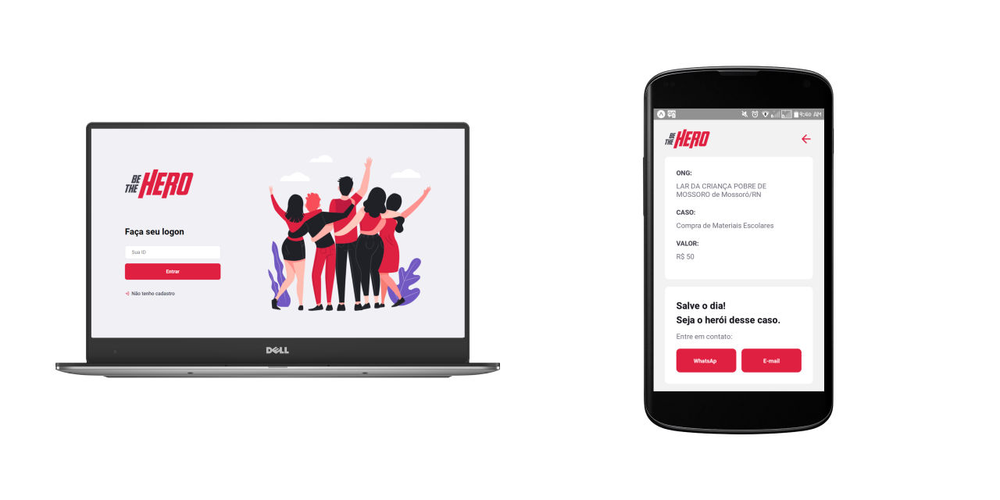

# :computer: Be The Hero

Projeto criado durante minha participação na 11ª versão do workshop "Semana Omnistack" organizada pela @Rocketseat.
A aplicação se trata de uma plataforma completa, incluindo um <i>app mobile</i>, na qual organizações não governamentais (ONG's) podem registrar e expor casos que necessitam de apoio financeiro.

**:star: Recursos:**

- API com validações e conexão com banco de dados SQL
- Plataforma web SPA.
- Aplicativo mobile com integração com o Whatsapp e serviço de E-mail.

**:rocket: Tecnologias:**

- [Node JS](https://nodejs.org/en/)
- [React JS](https://pt-br.reactjs.org/)
- [React Native](https://facebook.github.io/react-native/)
- [Expo](https://expo.io/)
- [SQLite](https://www.sqlite.org/index.html)

**:package: Bibliotecas:**
- [Express](https://expressjs.com/pt-br/)
- [React Navigation](https://reactnavigation.org/)
- [React Router](https://reacttraining.com/react-router/web/)
- [KNEX.js](http://knexjs.org/)
- [Axios](https://github.com/axios/axios)
- [Jest](https://jestjs.io/)
- [Supertest](https://www.npmjs.com/package/supertest)
- [Celebrate](https://www.npmjs.com/package/celebrate)

---

:coffee: Desenvolvido por Daniel Santos && [Rocketseat](https://github.com/Rocketseat)
